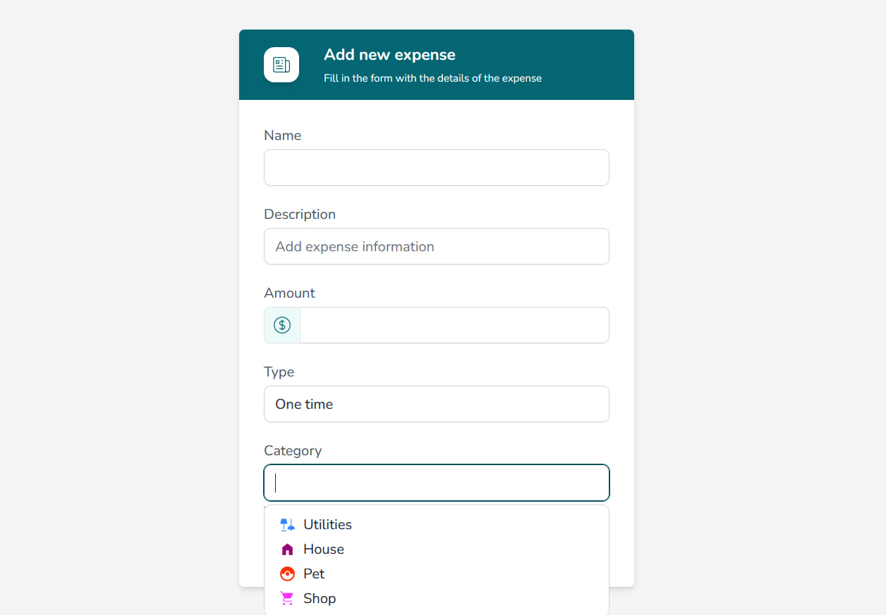
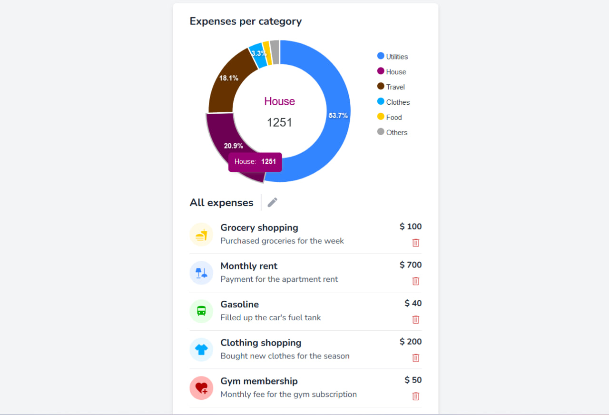

# Home Finances

A full-stack web application built with **Nuxt 4** for tracking personal and household finances. It runs with **server-side rendering (SSR)** on Nitro and persists data in **PostgreSQL** through **Drizzle ORM**, with authentication handled by **Supabase**.

## Features

- **Dashboard** — net worth snapshot, balance change, income, expenses, and cashflow summary with an Expenses vs Gains column chart.
- **Expenses** — track recurring and one-off expenses by category and frequency, with a donut chart breakdown.
- **Income** — log income streams by category and frequency.
- **Investments** — record holdings with current value, category, and description. Portfolio value is computed live and visualised with a donut (allocation) and line (value over time) chart.
- **Compound interest calculator** — estimate growth of an initial amount plus monthly contributions over time, with total invested and interest earned.
- **Authentication** — email/password login and signup powered by Supabase, with route protection on the API layer.

## Tech Stack

- **Framework:** [Nuxt 4](https://nuxt.com) (Vue 3, TypeScript)
- **Server:** Nitro (Nuxt's built-in server engine) — REST API routes under `server/api/`
- **Styling:** [Tailwind CSS v4](https://tailwindcss.com) via `@tailwindcss/vite`, `tailwind-scrollbar`
- **Fonts:** DM Sans Variable & DM Serif Display (Fontsource)
- **Icons:** [@nuxt/icon](https://github.com/nuxt/icon) with Material Symbols Light
- **Forms & validation:** [vee-validate](https://vee-validate.logaretm.com) (`@vee-validate/nuxt`)
- **Charts:** [ApexCharts](https://apexcharts.com) (`vue3-apexcharts`)
- **Database:** PostgreSQL with [Drizzle ORM](https://orm.drizzle.team) (`drizzle-kit` for migrations)
- **Auth:** [Supabase](https://supabase.com) (`@nuxtjs/supabase`)
- **Testing:** Vitest (unit & Nuxt environments), Playwright (E2E)
- **Code quality:** ESLint 9 + Prettier
- **Container:** Docker (multi-stage `Dockerfile`)
- **CI/CD:** Woodpecker (`.woodpecker.yml`) — builds, deploys via SSH, and runs migrations
- **Package manager:** pnpm

## Full Stack & SSR

This is a **full-stack application with server-side rendering (SSR) enabled**:

- **Full stack:** The frontend and backend live in the same Nuxt 4 codebase. The backend runs on Nitro, exposing REST API routes under `server/api/` (e.g. `expenses`, `investments`), a server middleware for auth (`server/middleware/auth.ts`), and direct database access via Drizzle ORM.
- **SSR:** Server-side rendering is enabled (Nuxt's default — no `ssr: false` in `nuxt.config.ts`), so pages are rendered on the server before being hydrated on the client.

## Project Structure

```
app/                    # Nuxt 4 frontend (Vue components, pages, composables, types, utils)
  components/           # AppCard, AppDialog, charts, forms, dashboard, navbar, ...
  pages/                # index, expenses, income, investments, compound-calculator, login, confirm
  layouts/              # default, auth
  composables/          # useDisplay
  utils/                # categories, frequencies, compound interest helpers, vee-validate rules
  types/                # expense, income, investment, compound, item, category
server/                 # Nitro server (backend)
  api/
    expenses/           # index.get / index.post / [id].put / [id].delete
    investments/        # index.get / index.post / [id].put / [id].delete
  db/schema.ts          # Drizzle schema (users, expenses, investments, income)
  middleware/auth.ts    # Protects /api/* with Supabase session
  orm/index.ts          # Drizzle client (pg)
public/                 # Static assets (screenshots, favicon)
compose.yaml            # Production Docker Compose definition (web service)
Dockerfile              # Multi-stage Node 24 build
drizzle.config.ts       # Drizzle Kit configuration
.env.example            # Template for required environment variables
```

## Database Schema

Defined in [`server/db/schema.ts`](server/db/schema.ts):

| Table         | Schema | Purpose                                                              |
| ------------- | ------ | -------------------------------------------------------------------- |
| `users`       | `auth` | Extends Supabase's `auth.users` with `full_name` and `phone`         |
| `expenses`    | public | Expense items (amount, name, category, frequency, description)       |
| `investments` | public | Holdings (name, category, amount, current_value, description)        |
| `income`      | public | Income streams (name, amount, frequency, description)                |

All data tables reference `auth.users.id` via `user_id`.

## API

All `/api/*` routes are protected by `server/middleware/auth.ts`, which throws `401 Unauthorized` when no Supabase session is present. The authenticated user is exposed on `event.context.user` (with `id` mapped from Supabase's `sub` claim).

| Method     | Path                  | Description                  |
| ---------- | --------------------- | ---------------------------- |
| `GET`      | `/api/expenses`       | List expenses for the user   |
| `POST`     | `/api/expenses`       | Create an expense            |
| `PUT`      | `/api/expenses/:id`   | Update an expense            |
| `DELETE`   | `/api/expenses/:id`   | Delete an expense            |
| `GET`      | `/api/investments`    | List investments for the user |
| `POST`     | `/api/investments`    | Create an investment         |
| `PUT`      | `/api/investments/:id`| Update an investment         |
| `DELETE`   | `/api/investments/:id`| Delete an investment         |

## Design




## Setup

### Prerequisites

- Node.js (see [`.nvmrc`](.nvmrc))
- pnpm
- A PostgreSQL instance (local install, Docker container, or managed service)
- A Supabase project (URL + anon key)

### Environment variables

Copy `.env.example` to `.env` and fill in your values:

```bash
cp .env.example .env
```

Required variables:

| Variable                    | Description                                              |
| --------------------------- | -------------------------------------------------------- |
| `NUXT_DB_HOST`              | PostgreSQL host (e.g. `localhost`)                       |
| `NUXT_DB_PORT`              | PostgreSQL port (default `5432`)                         |
| `NUXT_DB_NAME`              | PostgreSQL database name                                 |
| `NUXT_DB_USER`              | PostgreSQL user                                          |
| `NUXT_DB_PASSWORD`          | PostgreSQL password                                      |
| `NUXT_PUBLIC_SUPABASE_URL`  | Your Supabase project URL                                |
| `NUXT_PUBLIC_SUPABASE_KEY`  | Your Supabase anon key                                   |
| `APP_COMPOSE_PORT`          | Host port mapped to the container's `3000` (production)  |
| `NODE_ENV`                  | `development` or `production`                            |

### Installation

```bash
# install dependencies
pnpm install

# start the dev server with hot reload at http://localhost:3000
pnpm dev
```

### Database migrations

```bash
# generate migrations from the schema
pnpm drizzle-kit generate

# apply migrations
pnpm drizzle-kit migrate
```

## Testing

```bash
# run all tests
pnpm test

# unit tests only
pnpm test:unit

# Nuxt component tests only
pnpm test:nuxt

# E2E tests (Playwright)
pnpm test:e2e
```

## Linting

```bash
# check for lint errors
pnpm lint

# fix lint errors automatically
pnpm lint:fix
```

## Production build

### Local

```bash
pnpm build
pnpm preview
```

### Docker

The provided `compose.yaml` runs the Nuxt app in a container (it expects an external PostgreSQL reachable at the host configured in `.env`). The multi-stage `Dockerfile` builds the application and runs it with `node .output/server/index.mjs` on port `3000`.

```bash
docker compose build --no-cache
docker compose up -d

# apply migrations against the database referenced in .env
docker exec home-finances-web-1 pnpm drizzle-kit push
```

### Deployment

[`.woodpecker.yml`](.woodpecker.yml) defines a CI/CD pipeline that, on pushes to `main`:

1. Clones or pulls the repository on the target host over SSH.
2. Writes the production `.env` from pipeline secrets.
3. Rebuilds and restarts the Docker stack.
4. Runs `drizzle-kit push` inside the web container to sync the schema.

## License

[MIT](package.json)
